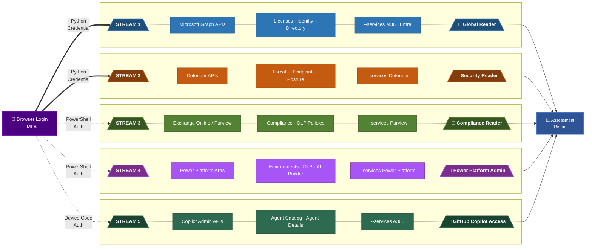

# Execution Guidelines: Interactive Browser Authentication

This document provides operational guidance for running the M365 Copilot Readiness Assessment tool using **interactive browser authentication** (`InteractiveBrowserCredential`) instead of a service principal. It covers the 5 API stream architecture, per-stream permission requirements, multi-user execution scenarios, and all prerequisites needed before first run — including app registration setup (automated or manual), delegated permission configuration, admin consent, and role assignments.

For the technical implementation plan (code changes, file modifications, backup strategy), see [`IMPLEMENTATION_PLAN_interactive_auth.md`](IMPLEMENTATION_PLAN_interactive_auth.md).

---

## Stream-Based Execution by User Permissions

### Architecture: 5 API Streams

The tool accesses 5 independent API streams. Each stream requires **different permissions** and can be run by **different users**:



### Stream-to-Permission Mapping

| Stream | `--services` Value | Minimum Entra Role | Delegated Permissions Required |
|--------|-------------------|-------------------|-------------------------------|
| **1. Graph** | `M365 Entra` | Global Reader | `User.Read.All`, `Directory.Read.All`, `Organization.Read.All`, `Reports.Read.All`, `AuditLog.Read.All`, `Sites.Read.All`, `Files.Read.All`, `ExternalConnection.Read.All`, `Channel.ReadBasic.All`, `OnlineMeetings.Read.All`, `Bookings.Read.All`, `People.Read.All`, `Printer.Read.All`, `Policy.Read.All`, `RoleManagement.Read.Directory`, `UserAuthenticationMethod.Read.All`, `AccessReview.Read.All`, `Application.Read.All`, `DeviceManagementManagedDevices.Read.All`, `DeviceManagementConfiguration.Read.All`, `NetworkAccessPolicy.Read.All` |
| **2. Defender** | `Defender` | Security Reader | `SecurityEvents.Read.All`, `SecurityIncident.Read.All`, `ThreatIndicators.Read.All`, `ThreatHunting.Read.All`, `ThreatAssessment.Read.All`, `IdentityRiskyUser.Read.All`, `IdentityRiskEvent.Read.All` + Defender API: `Machine.Read.All` |
| **3. Purview** | `Purview` | Compliance Reader | `InformationProtectionPolicy.Read` + Exchange Online PowerShell access (handled via `Connect-IPPSSession`) |
| **4. Power Platform** | `"Power Platform" "Copilot Studio"` | Power Platform Admin | Handled via PowerShell interactive login (separate from Graph) |
| **5. Copilot/A365** | `A365` | N/A (GitHub) | `User.Read`, `Directory.Read.All`, `CopilotPackages.Read.All` via `Connect-MgGraph` |

### Multi-User Execution Scenarios

**Scenario A: One user with all permissions (simplest)**
```powershell
python main.py --auth-mode interactive
# User must have: Global Reader + Security Reader + Compliance Reader
```

**Scenario B: Security team runs Defender only**
```powershell
python main.py --auth-mode interactive --services Defender
# User only needs: Security Reader role
# Delegated permissions: SecurityEvents.Read.All, ThreatHunting.Read.All, etc.
```

**Scenario C: IT Admin runs licensing/identity checks**
```powershell
python main.py --auth-mode interactive --services M365 Entra
# User only needs: Global Reader role
# Delegated permissions: User.Read.All, Directory.Read.All, Reports.Read.All, etc.
```

**Scenario D: Compliance officer runs Purview**
```powershell
python main.py --auth-mode interactive --services Purview
# User only needs: Compliance Reader / Compliance Admin
# Auth handled by PowerShell Connect-IPPSSession (already interactive)
```

**Scenario E: Power Platform admin runs Power Platform + Copilot Studio**
```powershell
python main.py --auth-mode interactive --services "Power Platform" "Copilot Studio"
# User only needs: Power Platform Admin / Environment Admin
# Auth handled by PowerShell interactive login (already interactive)
```

**Scenario F: Combined results from multiple users**
Each user runs their stream independently. Results export to separate files that can be combined.

### Design Decision: Token Scope Strategy

When `--auth-mode interactive` is used, the `InteractiveBrowserCredential` requests the `.default` scope for each API resource. This returns all delegated permissions that were admin-consented on the app registration — no per-stream scope filtering is needed.

| Services Selected | Scope Requested | Notes |
|---|---|---|
| `M365 Entra` | `https://graph.microsoft.com/.default` | All consented Graph delegated permissions |
| `Defender` | `https://graph.microsoft.com/.default` + `https://api.securitycenter.microsoft.com/.default` | Graph + Defender API |
| `Purview` | Minimal (PowerShell handles its own auth) | No Python credential used |
| `"Power Platform" "Copilot Studio"` | Minimal (PowerShell handles its own auth) | No Python credential used |
| `A365` | Minimal (PowerShell `Connect-MgGraph` handles its own auth) | No Python credential used |
| All (no `--services` flag) | All resource scopes as needed |  |

> **Note**: Streams 3, 4, and 5 already use interactive user auth via PowerShell subprocesses — the `InteractiveBrowserCredential` change only affects Streams 1 and 2 (Graph + Defender).

---

## Usage After Implementation

```powershell
# Service principal (unchanged, default)
python main.py --services M365 Entra Defender

# Interactive browser auth (new) — all services
python main.py --auth-mode interactive

# Interactive — specific stream by permission level
python main.py --auth-mode interactive --services M365 Entra
python main.py --auth-mode interactive --services Defender
python main.py --auth-mode interactive --services Purview
python main.py --auth-mode interactive --services "Power Platform" "Copilot Studio"
python main.py --auth-mode interactive --services A365
```

### `.env` for interactive mode
```
TENANT_ID=your-tenant-id
CLIENT_ID=your-app-registration-id
AUTH_MODE=interactive
```

---

## Prerequisites for Interactive Browser Mode

### A. Azure AD App Registration Setup

#### Option 1: Automated Setup (Recommended)

Run the provided script to create the app registration, configure delegated permissions per stream, grant admin consent, and generate the `.env` file — all in one step:

```powershell
# All streams (default — Graph + Defender + Purview)
.\setup-interactive-auth.ps1

# Only specific streams (least-privilege per team)
.\setup-interactive-auth.ps1 -Streams "1,2"    # IT Admin + Security
.\setup-interactive-auth.ps1 -Streams "2"      # Security team only
.\setup-interactive-auth.ps1 -Streams "1"      # IT Admin only
.\setup-interactive-auth.ps1 -Streams "3"      # Compliance only
```

The script:
- Creates a **public client** app registration (no secret)
- Sets redirect URI `http://localhost` and enables public client flows
- Adds **delegated** permissions (not application) for selected streams
- Detects Defender/O365 Management API availability in the tenant
- Opens browser for admin consent
- Writes `.env` with `AUTH_MODE=interactive`

> **Requires:** Global Administrator or Application Administrator role to run.

#### Option 2: Manual Setup (Portal)

1. **Create or modify an App Registration** in Azure Portal → Entra ID → App registrations
2. **Authentication settings:**
   - Platform: "Mobile and desktop applications"
   - Redirect URI: `http://localhost`
   - Toggle **"Allow public client flows"** = **Yes**
3. **No client secret needed** — delete existing secret if desired (not required)
4. Note down the **Application (client) ID** — this goes in `.env` as `CLIENT_ID`
5. Add delegated permissions per stream (see Section B below)
6. Grant admin consent

### B. Delegated Permissions by Stream

Add **only the permissions needed for the streams your user will run**. Grant admin consent per stream.

#### How to Add Delegated Permissions (Portal Step-by-Step)

**Navigate to:**
> Azure Portal → **Microsoft Entra ID** → **App registrations** → *[your app (CLIENT_ID)]* → **API permissions**

**Steps:**

1. Click **"+ Add a permission"**
2. Select the target API:
   - **For Stream 1 & Stream 2 (Graph permissions):** Choose **"Microsoft Graph"** → **"Delegated permissions"** → search & check each permission from the tables below
   - **For Stream 2 (Defender API):** Choose **"APIs my organization uses"** → search `WindowsDefenderATP` (or paste `fc780465-2017-40d4-a0c5-307022471b92`) → **"Delegated permissions"** → check `Machine.Read.All`
   - **For Stream 2 (O365 Management API):** Choose **"APIs my organization uses"** → search `Office 365 Management APIs` (or paste `c5393580-f805-4401-95e8-94b7a6ef2fc2`) → **"Delegated permissions"** → check `ActivityFeed.Read`, `ServiceHealth.Read`
   - **For Stream 3 (Purview):** Choose **"Microsoft Graph"** → **"Delegated permissions"** → check `InformationProtectionPolicy.Read`
3. Click **"Add permissions"**
4. Click **"Grant admin consent for [your tenant]"** (requires Global Admin)
5. Verify green checkmarks ✅ appear next to each permission

**Per-Stream Strategy:**

| Approach | When to Use |
|----------|-------------|
| Add all permissions at once | One admin runs all streams |
| Add per-stream permissions only | Different admins run different streams (least-privilege) |
| Separate app registrations per stream | Strict isolation between teams (advanced) |

> **Important:** Even if all permissions are consented on the app, the signed-in user can only access data their **Entra ID role** allows. Permissions + Role = Access.

---

#### Stream 1: Microsoft Graph (M365 + Entra) — User Role: Global Reader

| Permission | Purpose |
|-----------|---------|
| `User.Read.All` | Read all user profiles |
| `Directory.Read.All` | Read directory data |
| `Organization.Read.All` | Read organization info |
| `Policy.Read.All` | Read all policies |
| `RoleManagement.Read.Directory` | Read directory role assignments |
| `UserAuthenticationMethod.Read.All` | Read auth methods |
| `AccessReview.Read.All` | Read access reviews |
| `DeviceManagementManagedDevices.Read.All` | Read managed devices |
| `DeviceManagementConfiguration.Read.All` | Read device config |
| `NetworkAccessPolicy.Read.All` | Read network access policies |
| `Application.Read.All` | Read app registrations |
| `AuditLog.Read.All` | Read audit logs |
| `Reports.Read.All` | Read usage reports |
| `Sites.Read.All` | Read SharePoint sites |
| `Files.Read.All` | Read files |
| `ExternalConnection.Read.All` | Read Graph connectors |
| `Channel.ReadBasic.All` | Read Teams channels |
| `OnlineMeetings.Read.All` | Read meetings |
| `Bookings.Read.All` | Read bookings data |
| `People.Read.All` | Read people data |
| `Printer.Read.All` | Read printer data |
| `WorkplaceAnalytics-Reports.Read.All` | Read workplace analytics |

#### Stream 2: Defender — User Role: Security Reader

**Microsoft Graph delegated permissions:**

| Permission | Purpose |
|-----------|---------|
| `SecurityEvents.Read.All` | Read security events |
| `SecurityIncident.Read.All` | Read security incidents |
| `ThreatIndicators.Read.All` | Read threat indicators |
| `ThreatHunting.Read.All` | Read threat hunting data |
| `ThreatAssessment.Read.All` | Read threat assessments |
| `IdentityRiskyUser.Read.All` | Read risky user data |
| `IdentityRiskEvent.Read.All` | Read risk events |

**Defender for Endpoint API** (Resource: `fc780465-2017-40d4-a0c5-307022471b92`):

| Permission | Purpose |
|-----------|---------|
| `Machine.Read.All` | Read device/machine info from Defender |

**Office 365 Management API** (Resource: `c5393580-f805-4401-95e8-94b7a6ef2fc2`):

| Permission | Purpose |
|-----------|---------|
| `ActivityFeed.Read` | Read activity feed (Copilot telemetry) |
| `ServiceHealth.Read` | Read service health data |

#### Stream 3: Purview — User Role: Compliance Reader / Compliance Admin

| Permission | Purpose |
|-----------|---------|
| `InformationProtectionPolicy.Read` | Read info protection policies |

> **Note**: Purview primarily authenticates via PowerShell `Connect-IPPSSession` (interactive login). Only minimal Graph permissions needed.

#### Stream 4: Power Platform + Copilot Studio — User Role: Power Platform Admin

> No additional Graph delegated permissions required. Authentication is handled entirely via PowerShell interactive login subprocess.

#### Stream 5: A365 (Copilot Admin) — User Role: GitHub access

> No additional Graph delegated permissions required via this app registration. Authentication is handled via `Connect-MgGraph` device code flow in PowerShell with scopes: `User.Read`, `Directory.Read.All`, `CopilotPackages.Read.All`.

### C. Admin Consent

A **Global Admin** must grant consent. Options:

| Approach | When to Use |
|----------|-------------|
| Grant all permissions at once | Single user runs all streams |
| Grant per-stream permissions | Different users run different streams — consent only what each needs |

Azure Portal → App Registration → API Permissions → **"Grant admin consent for [tenant]"**

### D. User Role Assignments (per stream)

| Stream | Required Entra ID Role | Who Typically Has It |
|--------|----------------------|---------------------|
| 1. Graph (M365/Entra) | **Global Reader** | IT Admin, M365 Admin |
| 2. Defender | **Security Reader** | SOC Analyst, Security Admin |
| 3. Purview | **Compliance Reader** or **Compliance Admin** | Compliance Officer |
| 4. Power Platform | **Power Platform Admin** or Environment Admin | Power Platform Admin |
| 5. A365 | GitHub Copilot license + directory access | Developer Lead |

### E. Local Machine Requirements

| Requirement | Detail |
|-------------|--------|
| Python 3.9+ | Already required by this tool |
| `azure-identity` package | Already in `requirements.txt` |
| Web browser | Default browser will open for login |
| Network access | `http://localhost` must not be blocked by firewall |
| No proxy interference | Localhost redirect must reach back to Python process |
| PowerShell 7+ | Required for Streams 3, 4, 5 (already a tool prerequisite) |

### F. `.env` File Configuration

```ini
TENANT_ID=your-tenant-id
CLIENT_ID=your-app-registration-client-id
AUTH_MODE=interactive
# CLIENT_SECRET is NOT needed for interactive mode
```
