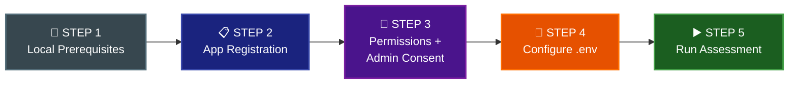

# Execution Guidelines: Interactive Browser Authentication

This document provides operational guidance for running the M365 Copilot Readiness Assessment tool using **interactive browser authentication** (`InteractiveBrowserCredential`) instead of a service principal.

For the technical implementation plan (code changes, file modifications, backup strategy), see [`INTERACTIVE-AUTH_ADJUSTMENT-PLAN.md`](INTERACTIVE-AUTH_ADJUSTMENT-PLAN.md).

> **Key simplification:** Interactive mode uses the well-known **Microsoft Graph PowerShell** public client ID (`14d82eec-204b-4c2f-b7e8-296a70dab67e`) by default. **No app registration is required.** Users only need their `TENANT_ID` and appropriate Entra ID roles. Optionally, a custom app registration can still be used if `CLIENT_ID` is set in `.env`.

---

## Process Overview

Follow these steps **in order**. The assessment cannot run without completing setup first.



| Step | What | Who | One-Time? |
|------|------|-----|-----------|
| **1** | Install Python, PowerShell, packages | Anyone | Yes |
| **2** | Create App Registration in Entra ID | Global Admin / App Admin | Yes |
| **3** | Add delegated permissions + grant admin consent | Global Admin | Yes |
| **4** | Write `.env` file with TENANT_ID + CLIENT_ID | Anyone | Yes |
| **5** | Run `python main.py --auth-mode interactive` | Assessment user | Repeatable |

---

## STEP 1: Local Machine Prerequisites

| Requirement | Detail |
|-------------|--------|
| Python 3.9+ | Already required by this tool |
| `azure-identity` package | Already in `requirements.txt` — run `pip install -r requirements.txt` |
| Web browser | Default browser will open for login |
| Network access | `http://localhost` must not be blocked by firewall |
| No proxy interference | Localhost redirect must reach back to Python process |
| PowerShell 7+ | Required for Streams 3, 4, 5 (already a tool prerequisite) |

---

## STEP 2: Configure `.env`

Create a `.env` file in the project root with **only your tenant ID**:

```ini
TENANT_ID=your-tenant-id-here
AUTH_MODE=interactive
```

That's it. No `CLIENT_ID` or `CLIENT_SECRET` needed — the tool uses the well-known Microsoft Graph PowerShell client ID (`14d82eec-204b-4c2f-b7e8-296a70dab67e`) automatically.

> **Optional:** If your organization requires a custom app registration (for auditing or permission restriction), set `CLIENT_ID=your-app-id` in `.env` and it will be used instead of the well-known default.

Then proceed to **STEP 3**.

---

## STEP 3: Run the Assessment

```powershell
# Stream 1: M365 + Entra (Graph API) — requires Global Reader
python main.py --auth-mode interactive --services M365 Entra

# Stream 2: Defender — requires Security Reader
python main.py --auth-mode interactive --services Defender

# Stream 3: Purview — requires Compliance Reader
python main.py --auth-mode interactive --services Purview

# Stream 4: Power Platform — requires Power Platform Admin
python main.py --auth-mode interactive --services "Power Platform" "Copilot Studio"

# Stream 5: Copilot/A365 — requires GitHub Copilot access
python main.py --auth-mode interactive --services A365

# All streams at once — requires all roles
python main.py --auth-mode interactive
```

A browser window will open for authentication. Complete MFA if required, and the assessment will proceed automatically.

> **Consent prompt on first run:** When using the well-known Graph PowerShell client ID, the user will see a consent prompt in the browser listing the scopes requested. An admin can pre-consent for the entire org via the Enterprise Applications blade for "Microsoft Graph PowerShell" if desired.

---

### Permissions Reference

Add **only the permissions needed for the streams you will run**. Then grant admin consent.

### How to Add Permissions (Portal)

**Navigate to:**
> Azure Portal → **Microsoft Entra ID** → **App registrations** → *[your app]* → **API permissions**

**Steps:**
1. Click **"+ Add a permission"**
2. Select the API and check the required permissions (see tables below)
3. Click **"Add permissions"**
4. Click **"Grant admin consent for [your tenant]"** (requires Global Admin)
5. Verify green checkmarks ✅ appear next to each permission

### Stream 1: Microsoft Graph (M365 + Entra) — User Role: Global Reader

**API:** Microsoft Graph → Delegated permissions

| Permission | Purpose |
|-----------|---------|
| `User.Read.All` | Read all user profiles |
| `Directory.Read.All` | Read directory data |
| `Organization.Read.All` | Read organization info |
| `Policy.Read.All` | Read all policies |
| `RoleManagement.Read.Directory` | Read directory role assignments |
| `UserAuthenticationMethod.Read.All` | Read auth methods |
| `AccessReview.Read.All` | Read access reviews |
| `DeviceManagementManagedDevices.Read.All` | Read managed devices |
| `DeviceManagementConfiguration.Read.All` | Read device config |
| `NetworkAccessPolicy.Read.All` | Read network access policies |
| `Application.Read.All` | Read app registrations |
| `AuditLog.Read.All` | Read audit logs |
| `Reports.Read.All` | Read usage reports |
| `Sites.Read.All` | Read SharePoint sites |
| `Files.Read.All` | Read files |
| `ExternalConnection.Read.All` | Read Graph connectors |
| `Channel.ReadBasic.All` | Read Teams channels |
| `OnlineMeetings.Read.All` | Read meetings |
| `Bookings.Read.All` | Read bookings data |
| `People.Read.All` | Read people data |
| `Printer.Read.All` | Read printer data |
| `WorkplaceAnalytics-Reports.Read.All` | Read workplace analytics |

### Stream 2: Defender — User Role: Security Reader

**Microsoft Graph** → Delegated permissions:

| Permission | Purpose |
|-----------|---------|
| `SecurityEvents.Read.All` | Read security events |
| `SecurityIncident.Read.All` | Read security incidents |
| `ThreatIndicators.Read.All` | Read threat indicators |
| `ThreatHunting.Read.All` | Read threat hunting data |
| `ThreatAssessment.Read.All` | Read threat assessments |
| `IdentityRiskyUser.Read.All` | Read risky user data |
| `IdentityRiskEvent.Read.All` | Read risk events |

**Defender for Endpoint API** — "APIs my organization uses" → search `WindowsDefenderATP` (ID: `fc780465-2017-40d4-a0c5-307022471b92`) → Delegated:

| Permission | Purpose |
|-----------|---------|
| `Machine.Read.All` | Read device/machine info from Defender |

**Office 365 Management API** — "APIs my organization uses" → search `Office 365 Management APIs` (ID: `c5393580-f805-4401-95e8-94b7a6ef2fc2`) → Delegated:

| Permission | Purpose |
|-----------|---------|
| `ActivityFeed.Read` | Read activity feed (Copilot telemetry) |
| `ServiceHealth.Read` | Read service health data |

### Stream 3: Purview — User Role: Compliance Reader / Compliance Admin

**API:** Microsoft Graph → Delegated permissions

| Permission | Purpose |
|-----------|---------|
| `InformationProtectionPolicy.Read` | Read info protection policies |

> **Note**: Purview primarily authenticates via PowerShell `Connect-IPPSSession` (interactive login). Only minimal Graph permissions needed.

### Stream 4: Power Platform + Copilot Studio — User Role: Power Platform Admin

> No additional Graph delegated permissions required. Authentication is handled entirely via PowerShell interactive login subprocess.

### Stream 5: A365 (Copilot Admin) — User Role: GitHub access

> No additional Graph delegated permissions required. Authentication is handled via `Connect-MgGraph` device code flow in PowerShell with scopes: `User.Read`, `Directory.Read.All`, `CopilotPackages.Read.All`.

### Admin Consent

A **Global Admin** must grant consent:

| Approach | When to Use |
|----------|-------------|
| Grant all permissions at once | Single user runs all streams |
| Grant per-stream permissions only | Different users run different streams — consent only what each needs |

Azure Portal → App Registration → API Permissions → **"Grant admin consent for [tenant]"**

> **Important:** Even if all permissions are consented on the app, the signed-in user can only access data their **Entra ID role** allows. Permissions + Role = Access.

---

## .env Configuration Reference

### Minimal `.env` (recommended — no app registration):

```ini
TENANT_ID=your-tenant-id
AUTH_MODE=interactive
```

### With custom app registration (optional):

```ini
TENANT_ID=your-tenant-id
CLIENT_ID=your-app-registration-client-id
AUTH_MODE=interactive
# CLIENT_SECRET is NOT needed for interactive mode
```

### Dedicated app per stream (optional strict isolation):

| File | App Registration | Permissions |
|------|-----------------|-------------|
| `.env.stream1` | "M365 Copilot Readiness - Stream 1 (Graph)" | Stream 1 delegated only |
| `.env.stream2` | "M365 Copilot Readiness - Stream 2 (Defender)" | Stream 2 delegated only |
| `.env` (from `-Streams "All"`) | "M365 Copilot Readiness - Interactive Auth" | All streams combined |

Each team copies their stream file to `.env` before running:
```powershell
Copy-Item .env.stream1 .env    # IT Admin
Copy-Item .env.stream2 .env    # Security team
```

> **Note**: Only Streams 1 and 2 use the Python `InteractiveBrowserCredential`. Streams 3–5 authenticate via PowerShell subprocesses with their own interactive login prompts.

---

## Architecture Reference

### 5 API Streams

The tool accesses 5 independent API streams. Each stream requires **different permissions** and can be run by **different users**:

```mermaid
flowchart TD
    %% Authentication Layer
    LOGIN["🔐 Browser Login + MFA"]

    %% Auth Method Router
    LOGIN --> AUTH_PYTHON["Python InteractiveBrowserCredential"]
    LOGIN --> AUTH_PS["PowerShell Interactive"]
    LOGIN --> AUTH_DC["Device Code Flow"]

    %% Streams
    subgraph STREAMS[" "]
        direction LR

        subgraph S1["STREAM 1 — Graph"]
            S1_CMD["--services M365 Entra"]
            S1_DATA["Licenses · Identity · Directory"]
            S1_ROLE["Role: Global Reader"]
        end

        subgraph S2["STREAM 2 — Defender"]
            S2_CMD["--services Defender"]
            S2_DATA["Threats · Endpoints · Posture"]
            S2_ROLE["Role: Security Reader"]
        end

        subgraph S3["STREAM 3 — Purview"]
            S3_CMD["--services Purview"]
            S3_DATA["Compliance · DLP Policies"]
            S3_ROLE["Role: Compliance Reader"]
        end

        subgraph S4["STREAM 4 — Power Platform"]
            S4_CMD["--services Power Platform"]
            S4_DATA["Environments · DLP · AI Builder"]
            S4_ROLE["Role: Power Platform Admin"]
        end

        subgraph S5["STREAM 5 — Copilot"]
            S5_CMD["--services A365"]
            S5_DATA["Agent Catalog · Details"]
            S5_ROLE["Role: GitHub Copilot Access"]
        end
    end

    %% Connections
    AUTH_PYTHON ==> S1_CMD
    AUTH_PYTHON ==> S2_CMD
    AUTH_PS -.-> S3_CMD
    AUTH_PS -.-> S4_CMD
    AUTH_DC -.-> S5_CMD

    %% Output
    S1_ROLE --> REPORT["📊 Assessment Report"]
    S2_ROLE --> REPORT
    S3_ROLE --> REPORT
    S4_ROLE --> REPORT
    S5_ROLE --> REPORT

    %% Styling
    classDef loginStyle fill:#4B0082,stroke:#6A0DAD,color:#FFF,stroke-width:2px
    classDef pythonAuth fill:#0D47A1,stroke:#1565C0,color:#FFF,stroke-width:2px
    classDef psAuth fill:#4E342E,stroke:#6D4C41,color:#FFF,stroke-width:2px
    classDef dcAuth fill:#1B5E20,stroke:#2E7D32,color:#FFF,stroke-width:2px
    classDef stream1 fill:#1565C0,stroke:#0D47A1,color:#FFF
    classDef stream2 fill:#E65100,stroke:#BF360C,color:#FFF
    classDef stream3 fill:#2E7D32,stroke:#1B5E20,color:#FFF
    classDef stream4 fill:#6A1B9A,stroke:#4A148C,color:#FFF
    classDef stream5 fill:#00695C,stroke:#004D40,color:#FFF
    classDef reportStyle fill:#1A237E,stroke:#283593,color:#FFF,stroke-width:2px

    class LOGIN loginStyle
    class AUTH_PYTHON pythonAuth
    class AUTH_PS psAuth
    class AUTH_DC dcAuth
    class S1_CMD,S1_DATA,S1_ROLE stream1
    class S2_CMD,S2_DATA,S2_ROLE stream2
    class S3_CMD,S3_DATA,S3_ROLE stream3
    class S4_CMD,S4_DATA,S4_ROLE stream4
    class S5_CMD,S5_DATA,S5_ROLE stream5
    class REPORT reportStyle
```



### Stream-to-Permission Mapping

| Stream | `--services` Value | Minimum Entra Role | Scenario | Delegated Permissions Required |
|--------|-------------------|-------------------|----------|-------------------------------|
| **1. Graph** | `M365 Entra` | Global Reader | **C** — IT Admin | `User.Read.All`, `Directory.Read.All`, `Organization.Read.All`, `Reports.Read.All`, `AuditLog.Read.All`, `Sites.Read.All`, `Files.Read.All`, `ExternalConnection.Read.All`, `Channel.ReadBasic.All`, `OnlineMeetings.Read.All`, `Bookings.Read.All`, `People.Read.All`, `Printer.Read.All`, `Policy.Read.All`, `RoleManagement.Read.Directory`, `UserAuthenticationMethod.Read.All`, `AccessReview.Read.All`, `Application.Read.All`, `DeviceManagementManagedDevices.Read.All`, `DeviceManagementConfiguration.Read.All`, `NetworkAccessPolicy.Read.All` |
| **2. Defender** | `Defender` | Security Reader | **B** — Security Team | `SecurityEvents.Read.All`, `SecurityIncident.Read.All`, `ThreatIndicators.Read.All`, `ThreatHunting.Read.All`, `ThreatAssessment.Read.All`, `IdentityRiskyUser.Read.All`, `IdentityRiskEvent.Read.All` + Defender API: `Machine.Read.All` |
| **3. Purview** | `Purview` | Compliance Reader | **D** — Compliance Officer | `InformationProtectionPolicy.Read` + Exchange Online PowerShell access (handled via `Connect-IPPSSession`) |
| **4. Power Platform** | `"Power Platform" "Copilot Studio"` | Power Platform Admin | **E** — Power Platform Admin | Handled via PowerShell interactive login (separate from Graph) |
| **5. Copilot/A365** | `A365` | N/A (GitHub) | **A** (all) or standalone | `User.Read`, `Directory.Read.All`, `CopilotPackages.Read.All` via `Connect-MgGraph` |

### User Role Assignments

| Stream | Required Entra ID Role | Who Typically Has It |
|--------|----------------------|---------------------|
| 1. Graph (M365/Entra) | **Global Reader** | IT Admin, M365 Admin |
| 2. Defender | **Security Reader** | SOC Analyst, Security Admin |
| 3. Purview | **Compliance Reader** or **Compliance Admin** | Compliance Officer |
| 4. Power Platform | **Power Platform Admin** or Environment Admin | Power Platform Admin |
| 5. A365 | GitHub Copilot license + directory access | Developer Lead |

### Token Scope Strategy

When `--auth-mode interactive` is used, the `InteractiveBrowserCredential` (using either the well-known Graph PowerShell client ID or a custom `CLIENT_ID`) requests the `.default` scope for each API resource. With the well-known client ID, users consent to scopes at login time. With a custom app, admin-consented permissions are used automatically.

| Services Selected | Scope Requested | Notes |
|---|---|---|
| `M365 Entra` | `https://graph.microsoft.com/.default` | All consented Graph delegated permissions |
| `Defender` | `https://graph.microsoft.com/.default` + `https://api.securitycenter.microsoft.com/.default` | Graph + Defender API |
| `Purview` | Minimal (PowerShell handles its own auth) | No Python credential used |
| `"Power Platform" "Copilot Studio"` | Minimal (PowerShell handles its own auth) | No Python credential used |
| `A365` | Minimal (PowerShell `Connect-MgGraph` handles its own auth) | No Python credential used |
| All (no `--services` flag) | All resource scopes as needed |  |

> **Note**: Streams 3, 4, and 5 already use interactive user auth via PowerShell subprocesses — the `InteractiveBrowserCredential` change only affects Streams 1 and 2 (Graph + Defender).

---

## Multi-User Execution Scenarios

**Scenario A: One user with all permissions (simplest)**
```powershell
python main.py --auth-mode interactive
# User must have: Global Reader + Security Reader + Compliance Reader
```

**Scenario B: Security team runs Defender only**
```powershell
python main.py --auth-mode interactive --services Defender
# User only needs: Security Reader role
```

**Scenario C: IT Admin runs licensing/identity checks**
```powershell
python main.py --auth-mode interactive --services M365 Entra
# User only needs: Global Reader role
```

**Scenario D: Compliance officer runs Purview**
```powershell
python main.py --auth-mode interactive --services Purview
# User only needs: Compliance Reader / Compliance Admin
```

**Scenario E: Power Platform admin runs Power Platform + Copilot Studio**
```powershell
python main.py --auth-mode interactive --services "Power Platform" "Copilot Studio"
# User only needs: Power Platform Admin / Environment Admin
```

**Scenario F: Combined results from multiple users**
Each user runs their stream independently. Results export to separate files that can be combined.

---

## Quick Reference: Service Principal vs Interactive

| Auth Mode | `.env` Required | App Registration | User Action |
|-----------|----------------|------------------|-------------|
| Service Principal (default) | `TENANT_ID` + `CLIENT_ID` + `CLIENT_SECRET` | **Required** | None (headless) |
| Interactive (new) | `TENANT_ID` + `AUTH_MODE=interactive` | **Not required** | Browser login + MFA |
| Interactive + custom app | `TENANT_ID` + `CLIENT_ID` + `AUTH_MODE=interactive` | Optional (for audit/policy) | Browser login + MFA |

```powershell
# Service principal (unchanged, default — no --auth-mode flag)
python main.py --services M365 Entra Defender

# Interactive browser auth — all services (no app registration needed)
python main.py --auth-mode interactive

# Interactive — specific stream
python main.py --auth-mode interactive --services M365 Entra
python main.py --auth-mode interactive --services Defender
python main.py --auth-mode interactive --services Purview
python main.py --auth-mode interactive --services "Power Platform" "Copilot Studio"
python main.py --auth-mode interactive --services A365
```
