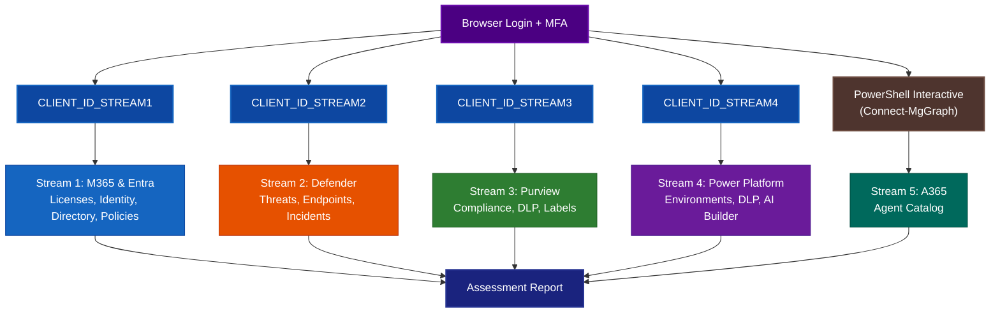

# Interactive Authentication — Setup & Run Guide

## What Is This?

The M365 Copilot Readiness Assessment tool can authenticate in two ways:

1. **Service Principal** (default) — headless, one app with all permissions + a secret
2. **Interactive Browser** — per-stream app registrations, delegated permissions, no secrets

This guide covers **option 2: Interactive Browser Authentication**.

### How It Works

- The tool is divided into **5 streams**, each covering a different Microsoft 365 area
- Streams 1–4 each get their **own app registration** with only the permissions they need
- Stream 5 (A365 / Copilot) authenticates via **Connect-MgGraph** (Microsoft Graph PowerShell) — no app registration needed
- A tenant admin creates the 4 apps **once** and grants admin consent
- Users run the tool → browser opens → they login with MFA → done
- No consent prompts at runtime (admin pre-granted)
- No client secrets to manage or rotate

### Why Per-Stream?

- **Least-privilege** — a Defender token cannot access M365 directory data
- **Role separation** — Security Reader runs Defender, Global Reader (or Compliance Administrator) runs Purview
- **Audit clarity** — each app's sign-in logs show exactly what was accessed

---

## Quick Start Flow


---

## Stream Reference



| `--services` | Stream | Env Variable | User Role | What It Collects |
|---|---|---|---|---|
| `M365` / `Entra` | 1 | `CLIENT_ID_STREAM1` | Global Reader | Licenses, Identity, Directory, Policies |
| `Defender` | 2 | `CLIENT_ID_STREAM2` | Security Reader | Threats, Endpoints, Incidents |
| `Purview` | 3 | `CLIENT_ID_STREAM3` | Global Reader  | Compliance, DLP, Labels |
| `"Power Platform"` / `"Copilot Studio"` | 4 | `CLIENT_ID_STREAM4` | Power Platform Admin | Environments, DLP, AI Builder |
| `A365` | 5 | *(none — uses `Connect-MgGraph`)* | Global Reader | Agent Catalog |


---

## STEP 1: Prerequisites

- Python 3.9+
- PowerShell 7+
- Run `pip install -r requirements.txt`
- Default browser available (opens for login)
- `http://localhost` not blocked by firewall/proxy

---

## STEP 2: Create Per-Stream App Registrations (Admin — One-Time)

**Who runs this step:** IT Admin (Global Admin or Application Administrator)

**Who does NOT run this step:** The assessment user — they only run Step 4.

---

### Option A: Automated (recommended)

Run the setup script. Each command creates the app, assigns permissions, grants admin consent, and writes the CLIENT_ID to `.env`:

```powershell
# ─── Create Stream 1 app (M365 & Entra) ───
.\setup-interactive-auth.ps1 -Streams "1"

# ─── Create Stream 2 app (Defender) ───
.\setup-interactive-auth.ps1 -Streams "2"

# ─── Create Stream 3 app (Purview) ───
.\setup-interactive-auth.ps1 -Streams "3"

# ─── Create Stream 4 app (Power Platform) ───
.\setup-interactive-auth.ps1 -Streams "4"

# ─── Or create ALL streams at once ───
.\setup-interactive-auth.ps1

# ─── Or combine specific streams ───
.\setup-interactive-auth.ps1 -Streams "1,2"
.\setup-interactive-auth.ps1 -Streams "1,3,4"
```

**After running:** The script outputs each app's Client ID. Give these to the assessment user:

| Stream | App Name | Value to share |
|--------|----------|---------------|
| 1 | Readiness - M365 & Entra | `CLIENT_ID_STREAM1` |
| 2 | Readiness - Defender | `CLIENT_ID_STREAM2` |
| 3 | Readiness - Purview | `CLIENT_ID_STREAM3` |
| 4 | Readiness - Power Platform | `CLIENT_ID_STREAM4` |
| 5 | *(no app registration)* | Uses `Connect-MgGraph` (browser login) |

> The admin's job ends here. The assessment user takes over at Step 3.

---

### Option B: Manual (Azure Portal) — Rare Use

<details>
<summary><strong>Click to expand manual app registration steps</strong></summary>

Go to **Azure Portal → Entra ID → App registrations → + New registration**

**Common settings for ALL apps:**

| Setting | Value |
|---------|-------|
| Supported account types | **Single tenant** |
| Redirect URI | Public client/native → `http://localhost` |
| Allow public client flows | **Yes** |

After creating each app: add the listed permissions → **Grant admin consent ✅** → copy Application (client) ID → save to `.env`.

---

**Stream 1** — `Readiness - M365 & Entra` · Role: `Global Reader` · Save as `CLIENT_ID_STREAM1`

Microsoft Graph → Delegated: `Organization.Read.All`, `Directory.Read.All`, `User.Read.All`, `Group.Read.All`, `Application.Read.All`, `AccessReview.Read.All`, `Policy.Read.All`, `RoleManagement.Read.Directory`, `UserAuthenticationMethod.Read.All`, `Reports.Read.All`, `AuditLog.Read.All`, `Sites.Read.All`, `Files.Read.All`, `ExternalConnection.Read.All`, `Channel.ReadBasic.All`, `OnlineMeetings.Read`, `Bookings.Read.All`, `People.Read.All`, `Printer.Read.All`, `DeviceManagementManagedDevices.Read.All`, `DeviceManagementConfiguration.Read.All`, `NetworkAccessPolicy.Read.All`

> ⚠️ Do NOT add `TeamsAppInstallation.ReadWriteAndConsentSelfForChat.All` — does not exist in Graph, causes AADSTS650051.

---

**Stream 2** — `Readiness - Defender` · Role: `Security Reader` · Save as `CLIENT_ID_STREAM2`

- Microsoft Graph → Delegated: `SecurityEvents.Read.All`, `SecurityIncident.Read.All`, `ThreatIndicators.Read.All`, `ThreatHunting.Read.All`, `ThreatAssessment.ReadWrite.All`, `IdentityRiskyUser.Read.All`, `IdentityRiskEvent.Read.All`
- WindowsDefenderATP API (under "APIs my organization uses") → Delegated: `Machine.Read`
- Office 365 Management APIs (under "APIs my organization uses") → Delegated: `ActivityFeed.Read`, `ServiceHealth.Read`

---

**Stream 3** — `Readiness - Purview` · Role: `Global Reader` (minimum) · Save as `CLIENT_ID_STREAM3`

Microsoft Graph → Delegated: `InformationProtectionPolicy.Read`, `Policy.Read.All`

> Global Reader covers the Graph delegated permissions. For full Purview PowerShell access (`Connect-IPPSSession` — DLP policies, sensitivity labels), assign **Compliance Administrator** (the lowest Entra role that maps to View-Only Organization Management in Purview).

---

**Stream 4** — `Readiness - Power Platform` · Role: `Power Platform Administrator` · Save as `CLIENT_ID_STREAM4`

Power Platform API (`https://api.bap.microsoft.com`) → Delegated: `user_impersonation`

> Power Platform data is mainly collected via PowerShell subprocess.

---

**Stream 5** — A365 / Copilot · Role: `Global Reader`

No app registration needed. Uses `Connect-MgGraph` interactive browser login.

</details>

---

## STEP 3: Pre-Assessment Configuration

Create `.env` in the project root with only the streams you plan to run.
Each `CLIENT_ID_STREAMx` corresponds to a specific assessment stream — you only need the ones relevant to your execution:

```ini
TENANT_ID=your-tenant-id-guid
AUTH_MODE=interactive

# Only include the CLIENT_IDs for the streams you will run:
CLIENT_ID_STREAM1=xxxxxxxx-xxxx-xxxx-xxxx-xxxxxxxxxxxx   # needed for: --services M365 Entra
CLIENT_ID_STREAM2=xxxxxxxx-xxxx-xxxx-xxxx-xxxxxxxxxxxx   # needed for: --services Defender
CLIENT_ID_STREAM3=xxxxxxxx-xxxx-xxxx-xxxx-xxxxxxxxxxxx   # needed for: --services Purview
CLIENT_ID_STREAM4=xxxxxxxx-xxxx-xxxx-xxxx-xxxxxxxxxxxx   # needed for: --services "Power Platform"
```

For example, if you only run Defender and Purview, your `.env` only needs `CLIENT_ID_STREAM2` and `CLIENT_ID_STREAM3`.

Also set `TENANT_ID` in `params.py`:

```python
TENANT_ID = "your-tenant-id-guid"
```

> No `CLIENT_SECRET` needed — all apps are public clients (delegated auth only).

---

## STEP 4: Run the Assessment

**Who:** Assessment user (not the admin who created the apps)

The assessment user only needs:
- The `.env` file (from admin)
- The correct Entra role for their stream
- A browser for login

```powershell
# Stream 1: M365 + Entra — role: Global Reader
python main.py --auth-mode interactive --services M365 Entra

# Stream 2: Defender — role: Security Reader
python main.py --auth-mode interactive --services Defender

# Stream 3: Purview — role: Global Reader (or Compliance Administrator for full PowerShell)
python main.py --auth-mode interactive --services Purview

# Stream 4: Power Platform — role: Power Platform Admin
python main.py --auth-mode interactive --services "Power Platform" "Copilot Studio"

# Stream 5: A365 — role: Global Reader + Microsoft.Graph PowerShell module
python main.py --auth-mode interactive --services A365

# All streams — requires all roles + all CLIENT_IDs
python main.py --auth-mode interactive
```

Browser opens → login + MFA → assessment runs. No consent prompts (admin pre-granted).

> **Role separation:** The admin creates apps (Step 2) and never runs the assessment. The assessment user runs the tool (Step 4) and never needs admin privileges.

---

## Comparison: Service Principal vs Interactive

| | Service Principal | Interactive (per-stream) |
|---|---|---|
| `.env` | `TENANT_ID` + `CLIENT_ID` + `CLIENT_SECRET` | `TENANT_ID` + `AUTH_MODE=interactive` + `CLIENT_ID_STREAMx` |
| Apps | 1 app (all permissions) | 1 app per stream (isolated) |
| User action | None (headless) | Browser login + MFA |
| Security | Secret must be rotated | No secret — delegated only |
