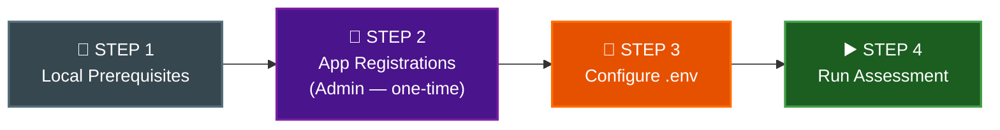
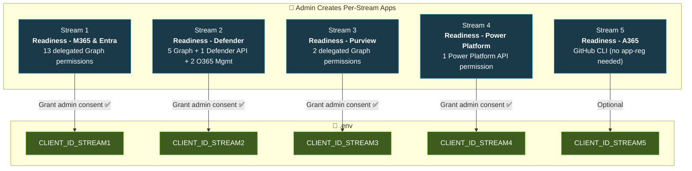

# Execution Guidelines: Interactive Browser Authentication

This document provides operational guidance for running the M365 Copilot Readiness Assessment tool using **interactive browser authentication** (`InteractiveBrowserCredential`) instead of a service principal.

For the technical implementation plan (code changes, file modifications), see [`interactive-auth_adjustment-plan.md`](interactive-auth_adjustment-plan.md).

> **Security model:** Interactive mode uses **per-stream app registrations** — each stream has its own app with ONLY the delegated permissions that stream needs. Admin creates apps once + grants consent. Users just login — their Entra role determines access, no consent prompts at runtime.

---

## Process Overview

Follow these steps **in order**. The assessment cannot run without completing setup first.



| Step | What | Who | One-Time? |
|------|------|-----|-----------|
| **1** | Install Python, PowerShell, packages | Anyone | Yes |
| **2** | Create per-stream app registrations + grant admin consent | **Tenant Admin** | Yes |
| **3a** | Set `TENANT_ID` in `params.py` **(mandatory)** | Anyone | Yes |
| **3b** | Write `.env` with `TENANT_ID` + `AUTH_MODE` + `CLIENT_ID_STREAMx` values | Anyone | Yes |
| **4** | Run `python main.py --auth-mode interactive --services ...` | Assessment user | Repeatable |

---

## STEP 1: Local Machine Prerequisites

| Requirement | Detail |
|-------------|--------|
| Python 3.9+ | Already required by this tool |
| `azure-identity` package | Already in `requirements.txt` — run `pip install -r requirements.txt` |
| Web browser | Default browser will open for login |
| Network access | `http://localhost` must not be blocked by firewall |
| No proxy interference | Localhost redirect must reach back to Python process |
| PowerShell 7+ | Required for Streams 3, 4, 5 (already a tool prerequisite) |

---

## STEP 2: Create Per-Stream App Registrations (Admin — One-Time)

**Who:** Tenant admin (Global Admin or Application Administrator role)

**Where:** Azure Portal → Microsoft Entra ID → App registrations → + New registration

Create **one app per stream**. Each app gets ONLY its stream's permissions — enforcing least-privilege isolation at the token level.



### Stream 1: `Readiness - M365 & Entra`

| Setting | Value |
|---------|-------|
| Name | `Readiness - M365 & Entra` |
| Supported account types | Single tenant |
| Redirect URI | Public client/native → `http://localhost` |
| Allow public client flows | **Yes** |

**API Permissions → Microsoft Graph → Delegated:**

| Permission | Purpose |
|-----------|---------|
| `Organization.Read.All` | Read tenant org info, subscriptions |
| `Directory.Read.All` | Read directory objects |
| `User.Read.All` | Read user profiles |
| `Group.Read.All` | Read group membership |
| `Application.Read.All` | Read app registrations |
| `AccessReview.Read.All` | Read access reviews |
| `Policy.Read.All` | Read conditional access policies |
| `RoleManagement.Read.Directory` | Read directory role assignments |
| `UserAuthenticationMethod.Read.All` | Read MFA methods |
| `Reports.Read.All` | Read usage reports |
| `AuditLog.Read.All` | Read audit logs |
| `Sites.Read.All` | Read SharePoint sites |
| `Files.Read.All` | Read OneDrive files |
| `ExternalConnection.Read.All` | Read Graph connectors |
| `Channel.ReadBasic.All` | Read Teams channels |
| `OnlineMeetings.Read.All` | Read meetings |
| `Bookings.Read.All` | Read bookings data |
| `People.Read.All` | Read people data |
| `Printer.Read.All` | Read printer data |
| `DeviceManagementManagedDevices.Read.All` | Read managed devices |
| `DeviceManagementConfiguration.Read.All` | Read device config |
| `NetworkAccessPolicy.Read.All` | Read network access policies |

**→ Click "Grant admin consent for [tenant]" ✅**

**Required Entra Role for user:** `Global Reader`

---

### Stream 2: `Readiness - Defender`

| Setting | Value |
|---------|-------|
| Name | `Readiness - Defender` |
| Supported account types | Single tenant |
| Redirect URI | Public client/native → `http://localhost` |
| Allow public client flows | **Yes** |

**API Permissions → Microsoft Graph → Delegated:**

| Permission | Purpose |
|-----------|---------|
| `SecurityEvents.Read.All` | Read security alerts |
| `SecurityIncident.Read.All` | Read security incidents |
| `ThreatIndicators.Read.All` | Read threat indicators |
| `ThreatHunting.Read.All` | Read threat hunting data |
| `ThreatAssessment.Read.All` | Read threat assessments |
| `IdentityRiskyUser.Read.All` | Read risky user data |
| `IdentityRiskEvent.Read.All` | Read risk events |

**Defender for Endpoint API** — "APIs my organization uses" → search `WindowsDefenderATP` (ID: `fc780465-2017-40d4-a0c5-307022471b92`) → Delegated:

| Permission | Purpose |
|-----------|---------|
| `Machine.Read.All` | Read device/machine info from Defender |

**Office 365 Management API** — "APIs my organization uses" → search `Office 365 Management APIs` (ID: `c5393580-f805-4401-95e8-94b7a6ef2fc2`) → Delegated:

| Permission | Purpose |
|-----------|---------|
| `ActivityFeed.Read` | Read activity feed (Copilot telemetry) |
| `ServiceHealth.Read` | Read service health data |

**→ Click "Grant admin consent for [tenant]" ✅**

**Required Entra Role for user:** `Security Reader`

---

### Stream 3: `Readiness - Purview`

| Setting | Value |
|---------|-------|
| Name | `Readiness - Purview` |
| Supported account types | Single tenant |
| Redirect URI | Public client/native → `http://localhost` |
| Allow public client flows | **Yes** |

**API Permissions → Microsoft Graph → Delegated:**

| Permission | Purpose |
|-----------|---------|
| `InformationProtectionPolicy.Read` | Read sensitivity labels |
| `Policy.Read.All` | Read DLP policies |

**→ Click "Grant admin consent for [tenant]" ✅**

**Required Entra Role for user:** `Compliance Reader` or `Compliance Admin`

> **Note:** Purview primarily authenticates via PowerShell `Connect-IPPSSession` (interactive login). Only minimal Graph permissions needed in this app.

---

### Stream 4: `Readiness - Power Platform`

| Setting | Value |
|---------|-------|
| Name | `Readiness - Power Platform` |
| Supported account types | Single tenant |
| Redirect URI | Public client/native → `http://localhost` |
| Allow public client flows | **Yes** |

**API Permissions → Power Platform API (`https://api.bap.microsoft.com`) → Delegated:**

| Permission | Purpose |
|-----------|---------|
| `user_impersonation` | Access Power Platform as signed-in user |

**→ Click "Grant admin consent for [tenant]" ✅**

**Required Entra Role for user:** `Power Platform Administrator`

> **Note:** Power Platform auth is primarily handled via PowerShell interactive subprocess.

---

### Stream 5: `Readiness - A365 (Copilot Catalog)`

No app registration needed. Uses GitHub CLI for agent catalog access.

Authentication is handled via `Connect-MgGraph` device code flow in PowerShell with scopes: `User.Read`, `Directory.Read.All`, `CopilotPackages.Read.All`.

**Required access:** GitHub org membership with Copilot license visibility.

---

## STEP 3: Configure Environment

### 3a. Update `params.py` (MANDATORY)

Open `params.py` in the project root and set your tenant ID:

```python
TENANT_ID = "your-tenant-id-here"  # e.g., 'contoso.onmicrosoft.com' or GUID
```

> **⚠️ This is the primary source of truth for tenant ID.** The tool reads it directly from this file. If this value is wrong, authentication will fail with `AADSTS90072`.

### 3b. Configure `.env`

Create a `.env` file in the project root with the per-stream CLIENT_IDs from Step 2:

```ini
TENANT_ID=your-tenant-id-here
AUTH_MODE=interactive

# Per-stream app registration Client IDs (from Step 2)
CLIENT_ID_STREAM1=<app-id-from-readiness-m365-entra>
CLIENT_ID_STREAM2=<app-id-from-readiness-defender>
CLIENT_ID_STREAM3=<app-id-from-readiness-purview>
CLIENT_ID_STREAM4=<app-id-from-readiness-power-platform>
CLIENT_ID_STREAM5=<app-id-from-readiness-a365>
```

> **No `CLIENT_SECRET` needed** — all apps are public clients (delegated auth, no secret).

> **Only set the streams you'll use.** If you only run M365 + Entra, you only need `CLIENT_ID_STREAM1`.

---

## STEP 4: Run the Assessment

```powershell
# Stream 1: M365 + Entra (Graph API) — requires Global Reader
python main.py --auth-mode interactive --services M365 Entra

# Stream 2: Defender — requires Security Reader
python main.py --auth-mode interactive --services Defender

# Stream 3: Purview — requires Compliance Reader
python main.py --auth-mode interactive --services Purview

# Stream 4: Power Platform — requires Power Platform Admin
python main.py --auth-mode interactive --services "Power Platform" "Copilot Studio"

# Stream 5: Copilot/A365 — requires GitHub Copilot access
python main.py --auth-mode interactive --services A365

# All streams at once — requires all roles + all CLIENT_IDs
python main.py --auth-mode interactive
```

A browser window will open for authentication. Complete MFA if required, and the assessment will proceed automatically.

> **No consent prompt** — admin already granted consent in Step 2. The user just logs in and their role determines access.

---

## Architecture Reference

### Per-Stream Isolation Model

```mermaid
flowchart TD
    %% Authentication Layer
    LOGIN["🔐 Browser Login + MFA"]

    %% Per-stream credentials
    LOGIN --> CRED1["Credential via<br/>CLIENT_ID_STREAM1"]
    LOGIN --> CRED2["Credential via<br/>CLIENT_ID_STREAM2"]
    LOGIN --> AUTH_PS["PowerShell Interactive<br/>(Streams 3-5)"]

    %% Streams
    subgraph STREAMS[" "]
        direction LR

        subgraph S1["STREAM 1 — M365 & Entra"]
            S1_CMD["--services M365 Entra"]
            S1_DATA["Licenses · Identity · Directory · Policies"]
            S1_ROLE["Role: Global Reader"]
        end

        subgraph S2["STREAM 2 — Defender"]
            S2_CMD["--services Defender"]
            S2_DATA["Threats · Endpoints · Incidents · RiskyUsers"]
            S2_ROLE["Role: Security Reader"]
        end

        subgraph S3["STREAM 3 — Purview"]
            S3_CMD["--services Purview"]
            S3_DATA["Compliance · DLP · Sensitivity Labels"]
            S3_ROLE["Role: Compliance Reader"]
        end

        subgraph S4["STREAM 4 — Power Platform"]
            S4_CMD["--services Power Platform"]
            S4_DATA["Environments · DLP · AI Builder"]
            S4_ROLE["Role: Power Platform Admin"]
        end

        subgraph S5["STREAM 5 — Copilot"]
            S5_CMD["--services A365"]
            S5_DATA["Agent Catalog · Details"]
            S5_ROLE["Role: GitHub Copilot Access"]
        end
    end

    %% Connections
    CRED1 ==> S1_CMD
    CRED2 ==> S2_CMD
    AUTH_PS -.-> S3_CMD
    AUTH_PS -.-> S4_CMD
    AUTH_PS -.-> S5_CMD

    %% Output
    S1_ROLE --> REPORT["📊 Assessment Report"]
    S2_ROLE --> REPORT
    S3_ROLE --> REPORT
    S4_ROLE --> REPORT
    S5_ROLE --> REPORT

    %% Styling
    classDef loginStyle fill:#4B0082,stroke:#6A0DAD,color:#FFF,stroke-width:2px
    classDef credStyle fill:#0D47A1,stroke:#1565C0,color:#FFF,stroke-width:2px
    classDef psAuth fill:#4E342E,stroke:#6D4C41,color:#FFF,stroke-width:2px
    classDef stream1 fill:#1565C0,stroke:#0D47A1,color:#FFF
    classDef stream2 fill:#E65100,stroke:#BF360C,color:#FFF
    classDef stream3 fill:#2E7D32,stroke:#1B5E20,color:#FFF
    classDef stream4 fill:#6A1B9A,stroke:#4A148C,color:#FFF
    classDef stream5 fill:#00695C,stroke:#004D40,color:#FFF
    classDef reportStyle fill:#1A237E,stroke:#283593,color:#FFF,stroke-width:2px

    class LOGIN loginStyle
    class CRED1,CRED2 credStyle
    class AUTH_PS psAuth
    class S1_CMD,S1_DATA,S1_ROLE stream1
    class S2_CMD,S2_DATA,S2_ROLE stream2
    class S3_CMD,S3_DATA,S3_ROLE stream3
    class S4_CMD,S4_DATA,S4_ROLE stream4
    class S5_CMD,S5_DATA,S5_ROLE stream5
    class REPORT reportStyle
```



### Stream-to-App Mapping (Code Logic)

| `--services` Value | Env Variable Used | App Registration |
|-------------------|------------------|-----------------|
| `M365` | `CLIENT_ID_STREAM1` | `Readiness - M365 & Entra` |
| `Entra` | `CLIENT_ID_STREAM1` | `Readiness - M365 & Entra` |
| `Defender` | `CLIENT_ID_STREAM2` | `Readiness - Defender` |
| `Purview` | `CLIENT_ID_STREAM3` | `Readiness - Purview` |
| `"Power Platform"` | `CLIENT_ID_STREAM4` | `Readiness - Power Platform` |
| `"Copilot Studio"` | `CLIENT_ID_STREAM4` | `Readiness - Power Platform` |
| `A365` | `CLIENT_ID_STREAM5` | `Readiness - A365` |

### Token Scope Strategy

Each app uses `.default` scope — which returns ALL delegated permissions that admin pre-consented for that specific app:

| Services Selected | App Used | Scope Requested |
|---|---|---|
| `M365 Entra` | Stream 1 app | `https://graph.microsoft.com/.default` |
| `Defender` | Stream 2 app | `https://graph.microsoft.com/.default` + `https://api.securitycenter.microsoft.com/.default` |
| `Purview` | Stream 3 app | Minimal (PowerShell handles its own auth) |
| `"Power Platform"` | Stream 4 app | Minimal (PowerShell handles its own auth) |
| `A365` | Stream 5 app | Minimal (PowerShell `Connect-MgGraph` handles its own auth) |
| `M365 Defender` | Stream 1 + Stream 2 apps | Two credentials, one per app |

> **Isolation guarantee:** Token from Stream 2 app CANNOT call Stream 1 APIs — the app doesn't have those permissions registered.

---

## Role-to-Access Matrix

| Stream | App Registration | `--services` | User Role | What They Can Access |
|--------|-----------------|-------------|-----------|---------------------|
| 1 | `Readiness - M365 & Entra` | `M365 Entra` | **Global Reader** | Licenses, users, directory, policies |
| 2 | `Readiness - Defender` | `Defender` | **Security Reader** | Security events, threats, risky users |
| 3 | `Readiness - Purview` | `Purview` | **Compliance Reader** | Sensitivity labels, DLP policies |
| 4 | `Readiness - Power Platform` | `"Power Platform"` | **Power Platform Admin** | Environments, DLP, AI Builder |
| 5 | `Readiness - A365` | `A365` | **GitHub access** | Agent catalog, copilot details |

---

## Multi-User Execution Scenarios

**Scenario A: Full assessment (admin with all roles)**
```powershell
python main.py --auth-mode interactive
# User must have: Global Reader + Security Reader + Compliance Reader + PP Admin
# Opens browser once per unique app (max 4 logins)
```

**Scenario B: IT Admin runs licensing/identity checks (Stream 1)**
```powershell
python main.py --auth-mode interactive --services M365 Entra
# Uses CLIENT_ID_STREAM1 → only M365/Entra scopes in token
# User only needs: Global Reader role
```

**Scenario C: Security team runs Defender (Stream 2)**
```powershell
python main.py --auth-mode interactive --services Defender
# Uses CLIENT_ID_STREAM2 → only Defender scopes in token
# User only needs: Security Reader role
```

**Scenario D: Compliance officer runs Purview (Stream 3)**
```powershell
python main.py --auth-mode interactive --services Purview
# Uses CLIENT_ID_STREAM3 → only Purview scopes in token
# User only needs: Compliance Reader / Compliance Admin
```

**Scenario E: Power Platform admin (Stream 4)**
```powershell
python main.py --auth-mode interactive --services "Power Platform" "Copilot Studio"
# Uses CLIENT_ID_STREAM4 → only Power Platform scopes
# User only needs: Power Platform Admin / Environment Admin
```

**Scenario F: Multi-stream (two teams, same run)**
```powershell
python main.py --auth-mode interactive --services M365 Defender
# Uses CLIENT_ID_STREAM1 + CLIENT_ID_STREAM2 → two separate credentials
# Opens browser once per app (2 logins)
# Each API call uses the correct stream's credential
```

**Scenario G: Combined results from multiple users**
Each user runs their stream independently. Results export to separate files that can be combined.

---

## Quick Reference: Service Principal vs Interactive

| Auth Mode | `.env` Required | App Registration | User Action |
|-----------|----------------|------------------|-------------|
| Service Principal (default) | `TENANT_ID` + `CLIENT_ID` + `CLIENT_SECRET` | 1 app (all permissions) | None (headless) |
| **Interactive (per-stream)** | `TENANT_ID` + `AUTH_MODE=interactive` + `CLIENT_ID_STREAMx` | **1 app per stream** | Browser login + MFA |

```powershell
# Service principal (unchanged, default — no --auth-mode flag)
python main.py --services M365 Entra Defender

# Interactive — specific stream (each uses its own app)
python main.py --auth-mode interactive --services M365 Entra
python main.py --auth-mode interactive --services Defender
python main.py --auth-mode interactive --services Purview
python main.py --auth-mode interactive --services "Power Platform" "Copilot Studio"
python main.py --auth-mode interactive --services A365

# Interactive — all streams
python main.py --auth-mode interactive
```

---

## Setup Automation: `setup-interactive-auth.ps1`

Run this script to automate Step 2 (creates all per-stream app registrations):

```powershell
.\setup-interactive-auth.ps1
```

The script will:
1. Create each per-stream app registration
2. Add ONLY that stream's delegated permissions
3. Grant admin consent for each app
4. Output all `CLIENT_ID_STREAMx` values to `.env`

> **Requires:** Global Admin or Application Administrator role + `az login` first.
