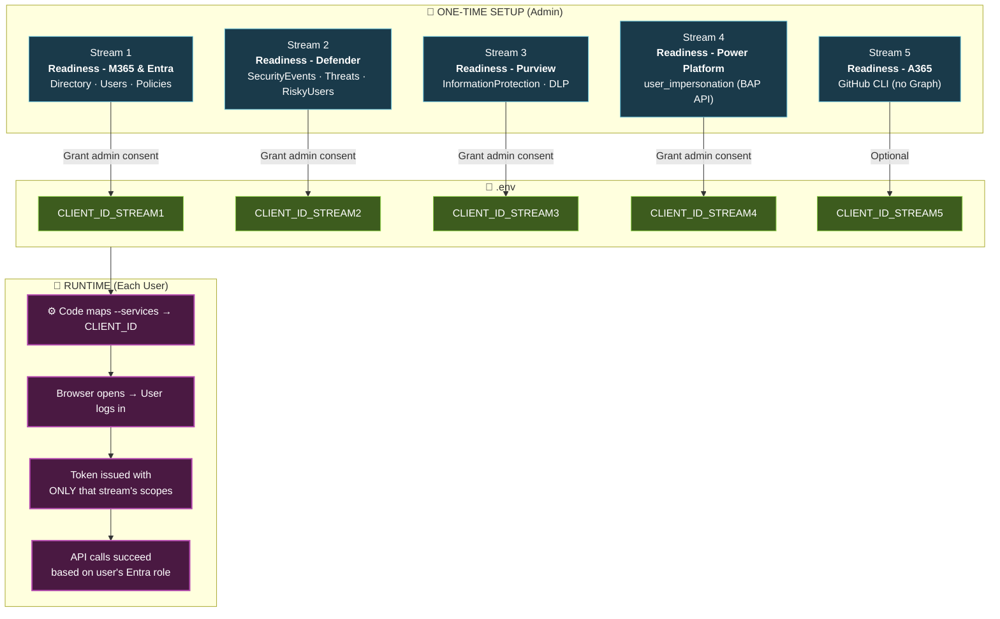

# Implementation Plan: Interactive Auth — Per-Stream App Registrations

## Objective

Enable interactive browser authentication with **strict isolation per stream**:
- **One app registration per stream** — each has ONLY the delegated permissions that stream needs
- **Each stream user** logs in with browser, their Entra role determines access
- **No runtime consent prompts** — admin pre-grants consent per app
- **Least privilege enforced** — a Defender user cannot access M365 data and vice versa

---

## Why Per-Stream Apps (Not One App For All)

| Approach | Problem |
|----------|---------|
| Single app with all permissions | Over-privileged — any user gets token with ALL scopes |
| **Separate app per stream** | Each app has only its scopes. User token is limited to that stream. |

**Security principle:** If Security Reader logs in with the Defender app, the token only contains Defender scopes. They cannot call M365/directory APIs even if they try.

---

## Architecture



---

## `.env`

```ini
TENANT_ID=<tenant-id>
AUTH_MODE=interactive

# Per-stream app registration Client IDs
CLIENT_ID_STREAM1=<app-id-m365-entra>
CLIENT_ID_STREAM2=<app-id-defender>
CLIENT_ID_STREAM3=<app-id-purview>
CLIENT_ID_STREAM4=<app-id-power-platform>
CLIENT_ID_STREAM5=<app-id-a365>
```

No `CLIENT_SECRET` needed — all are **public clients** (delegated, no secret).

---

## App Registrations — Full Definition

### Stream 1: `Readiness - M365 & Entra`

**Portal:** Entra ID → App registrations → + New registration

| Setting | Value |
|---------|-------|
| Name | `Readiness - M365 & Entra` |
| Supported account types | Single tenant |
| Redirect URI | Public client/native → `http://localhost` |
| Allow public client flows | **Yes** |

**API Permissions → Microsoft Graph → Delegated:**

| Permission | Why |
|-----------|-----|
| `Organization.Read.All` | Read tenant org info, subscriptions |
| `Directory.Read.All` | Read directory objects |
| `User.Read.All` | Read user profiles |
| `Group.Read.All` | Read group membership |
| `Application.Read.All` | Read app registrations |
| `AccessReview.Read.All` | Read access reviews |
| `Policy.Read.All` | Read conditional access policies |
| `RoleManagement.Read.Directory` | Read directory role assignments |
| `UserAuthenticationMethod.Read.All` | Read MFA methods |
| `Reports.Read.All` | Read usage reports |
| `AuditLog.Read.All` | Read audit logs |
| `Sites.Read.All` | Read SharePoint sites |
| `Files.Read.All` | Read OneDrive files |

**→ Click "Grant admin consent for [tenant]" ✅**

**Required Entra Role for user:** `Global Reader`

---

### Stream 2: `Readiness - Defender`

| Setting | Value |
|---------|-------|
| Name | `Readiness - Defender` |
| Supported account types | Single tenant |
| Redirect URI | Public client/native → `http://localhost` |
| Allow public client flows | **Yes** |

**API Permissions → Microsoft Graph → Delegated:**

| Permission | Why |
|-----------|-----|
| `SecurityEvents.Read.All` | Read security alerts |
| `SecurityIncident.Read.All` | Read incidents |
| `ThreatIndicators.Read.All` | Read threat intel |
| `IdentityRiskyUser.Read.All` | Read risky users |
| `IdentityRiskEvent.Read.All` | Read risk events |

**→ Click "Grant admin consent for [tenant]" ✅**

**Required Entra Role for user:** `Security Reader`

---

### Stream 3: `Readiness - Purview`

| Setting | Value |
|---------|-------|
| Name | `Readiness - Purview` |
| Supported account types | Single tenant |
| Redirect URI | Public client/native → `http://localhost` |
| Allow public client flows | **Yes** |

**API Permissions → Microsoft Graph → Delegated:**

| Permission | Why |
|-----------|-----|
| `InformationProtectionPolicy.Read` | Read sensitivity labels |
| `Policy.Read.All` | Read DLP policies |

**→ Click "Grant admin consent for [tenant]" ✅**

**Required Entra Role for user:** `Compliance Reader`

---

### Stream 4: `Readiness - Power Platform`

| Setting | Value |
|---------|-------|
| Name | `Readiness - Power Platform` |
| Supported account types | Single tenant |
| Redirect URI | Public client/native → `http://localhost` |
| Allow public client flows | **Yes** |

**API Permissions → Power Platform API (`https://api.bap.microsoft.com`) → Delegated:**

| Permission | Why |
|-----------|-----|
| `user_impersonation` | Access Power Platform as user |

**→ Click "Grant admin consent for [tenant]" ✅**

**Required Entra Role for user:** `Power Platform Administrator`

---

### Stream 5: `Readiness - A365 (Copilot Catalog)`

Uses GitHub CLI — no Graph permissions needed. Optional app-reg if GitHub Enterprise auth is needed.

**Required access:** GitHub org membership with Copilot license visibility.

---

## Stream-to-App Mapping in Code

```python
# Core/get_graph_client.py

STREAM_CLIENT_ID_MAP = {
    'M365':            'CLIENT_ID_STREAM1',
    'Entra':           'CLIENT_ID_STREAM1',
    'Defender':        'CLIENT_ID_STREAM2',
    'Purview':         'CLIENT_ID_STREAM3',
    'Power Platform':  'CLIENT_ID_STREAM4',
    'A365':            'CLIENT_ID_STREAM5',
}
```

At runtime, the code resolves the correct `CLIENT_ID` based on `--services`:
- `--services M365 Entra` → uses `CLIENT_ID_STREAM1`
- `--services Defender` → uses `CLIENT_ID_STREAM2`
- `--services M365 Defender` → uses BOTH apps (two credentials)

---

## How It Works At Runtime

1. User runs `python main.py --auth-mode interactive --services Defender`
2. Code maps `Defender` → `CLIENT_ID_STREAM2` from `.env`
3. `InteractiveBrowserCredential(tenant_id=..., client_id=CLIENT_ID_STREAM2)` opens browser
4. User logs in → token contains ONLY Defender scopes (pre-consented)
5. Defender API calls succeed if user has `Security Reader` role
6. **Cannot access M365 directory data** — app doesn't have those permissions

### Multi-Stream Run

```bash
python main.py --auth-mode interactive --services M365 Defender
```

- Creates TWO credentials (one per app)
- Opens browser ONCE per unique CLIENT_ID (if streams share an app, only one login)
- Each Graph/API call uses the credential for its stream

---

## Code Changes

### `Core/get_graph_client.py`

```python
STREAM_CLIENT_ID_MAP = {
    'M365':            'CLIENT_ID_STREAM1',
    'Entra':           'CLIENT_ID_STREAM1',
    'Defender':        'CLIENT_ID_STREAM2',
    'Purview':         'CLIENT_ID_STREAM3',
    'Power Platform':  'CLIENT_ID_STREAM4',
    'A365':            'CLIENT_ID_STREAM5',
}

_credentials = {}  # Cache per client_id

def get_credential_for_stream(stream_name: str, tenant_id: str):
    env_var = STREAM_CLIENT_ID_MAP.get(stream_name)
    client_id = os.getenv(env_var)
    
    if not client_id:
        raise ValueError(
            f"Missing {env_var} for stream '{stream_name}'. "
            f"Create app registration and set {env_var} in .env."
        )
    
    if client_id not in _credentials:
        _credentials[client_id] = InteractiveBrowserCredential(
            tenant_id=tenant_id,
            client_id=client_id
        )
    
    return _credentials[client_id]
```

### Files to Modify

| # | File | Change | Status |
|---|------|--------|--------|
| 1 | `Core/get_graph_client.py` | Stream→CLIENT_ID mapping, per-stream credential cache | TODO |
| 2 | `Core/credentials_check.py` | Validate correct `CLIENT_ID_STREAMx` present for requested services | TODO |
| 3 | `setup-interactive-auth.ps1` | Create ALL 4 app-regs + grant consent for each | TODO |
| 4 | `.env` | Add all `CLIENT_ID_STREAMx` values | TODO |

---

## Role-to-Access Matrix

| Stream | App Registration | `--services` | User Role | Scopes in Token |
|--------|-----------------|-------------|-----------|-----------------|
| 1 | `Readiness - M365 & Entra` | `M365 Entra` | **Global Reader** | Directory, Users, Policies |
| 2 | `Readiness - Defender` | `Defender` | **Security Reader** | SecurityEvents, Threats |
| 3 | `Readiness - Purview` | `Purview` | **Compliance Reader** | InformationProtection |
| 4 | `Readiness - Power Platform` | `"Power Platform"` | **Power Platform Admin** | user_impersonation |
| 5 | `Readiness - A365` | `A365` | **GitHub access** | N/A (GitHub CLI) |

**Isolation enforced:** Token from Stream 2 app CANNOT call Stream 1 APIs — app doesn't have those permissions.

---

## Setup Script: `setup-interactive-auth.ps1`

Creates ALL per-stream app registrations in one run:

```powershell
# For each stream:
#   1. Create app registration
#   2. Add ONLY that stream's delegated permissions
#   3. Grant admin consent
#   4. Output CLIENT_ID_STREAMx to .env
```

---

## Execution Examples

```bash
# IT Admin (Global Reader) — Stream 1 only
python main.py --auth-mode interactive --services M365 Entra

# Security team (Security Reader) — Stream 2 only
python main.py --auth-mode interactive --services Defender

# Compliance team — Stream 3 only
python main.py --auth-mode interactive --services Purview

# Full assessment (admin with all roles) — all streams
python main.py --auth-mode interactive --services M365 Entra Defender Purview "Power Platform"
# → Opens browser once per unique app (max 4 logins if all streams requested)
```
